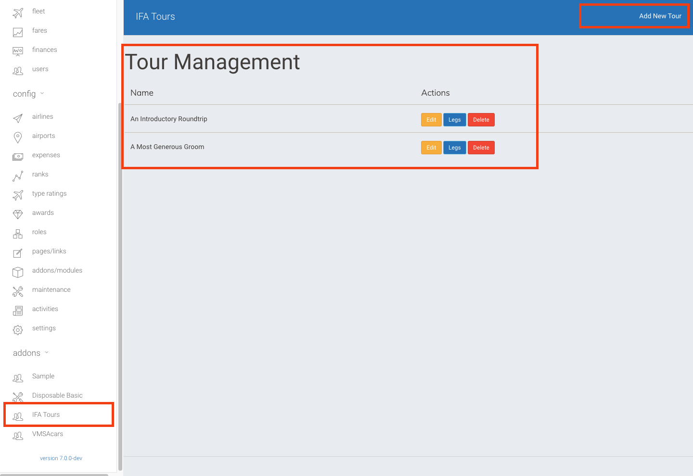
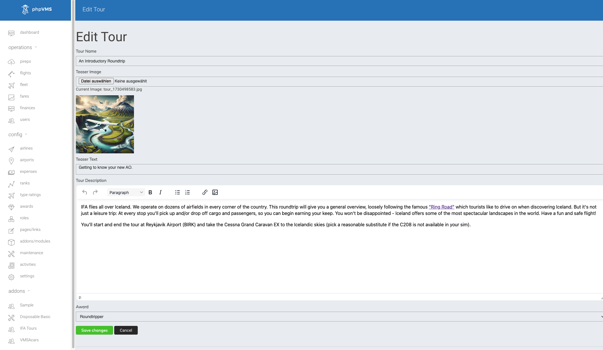
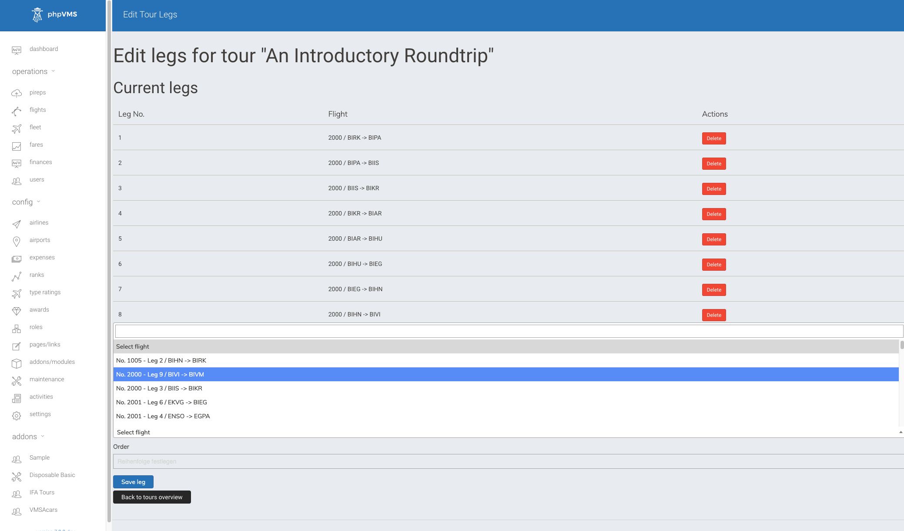
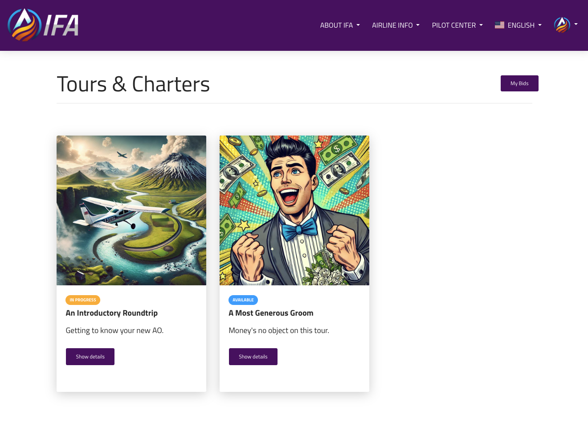
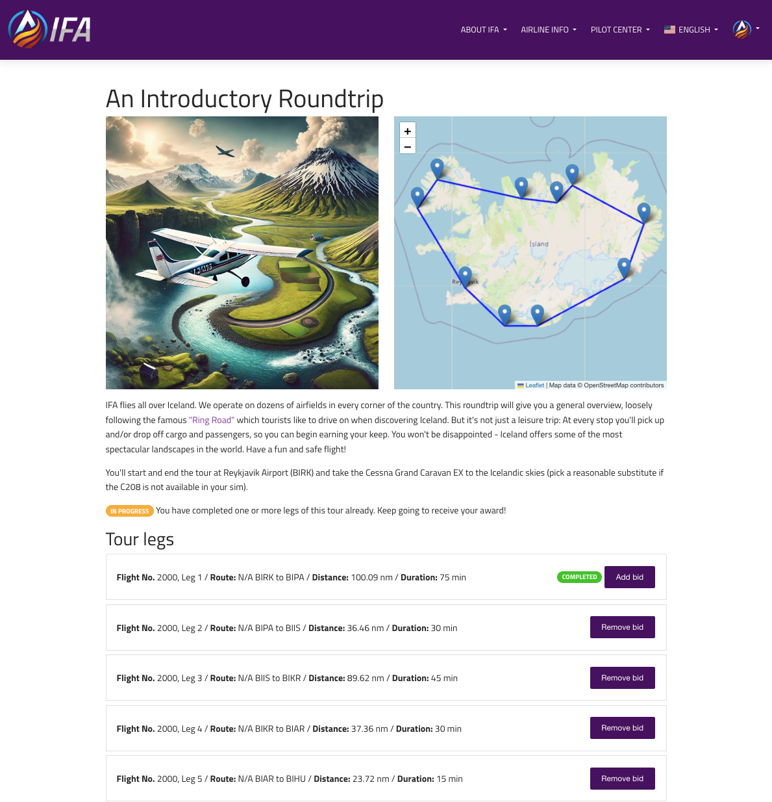

# IFA Tours
Simple tours plugin for phpVMSv7 created by MattW for IceFireAir Virtual Airline. Feel free to use for your own VA.
* IFA: https://www.icefireair.com
* phpVMS: https://github.com/nabeelio/phpvms

## Features
* Adds to phpVMS a Tour/Charter system for airline managers to group flights into tours.
* Each tour consists of several legs/flights which can be bid on and completed separately. The plugin keeps track of the pilot's progress and automatically issues an award (if one was added to the tour), once all PIREPs from the tour legs were accepted.
* IfaTours makes as much use of core functionality as possible, using the default awards and flights from phpVMS. If you don't like it you can safely remove the plugin and move on, IfaTours won't modify the code or database tables from the core phpVMS system.
* Image upload feature is included in the tour creation. I'm a lazy ass and hate it when I have to use a separate tool to upload files to a server (e.g. teaser images for my tours...)







## Requirements
* Make sure you run a recent dev version of phpVMS v7, from Sept 2024 or later (just pull the latest dev, don't use any of the older "releases")
* You should be familiar with and have access to ssh, composer and git on your webhosting system

## Installation
1. Go into the ```modules``` folder in your phpVMS installation and clone this git repository: ```git clone https://github.com/FnordLord/IfaTours.git```
2. Run ```composer install``` inside the IfaTours folder. This is necessary because the plugin needs one dependency not included in the default phpVMS installation, which is ```"intervention/image``` for image manipulation
3. In your phpVMS backend go to the addons/modules section and activate the IfaTours plugin.
4. Run ```yourdomain.com/dir-to-your-phpvms/update``` so all database migrations for the plugin can be executed
5. That should do it. You're welcome to add issues here in the github repo if you encounter problems. You can bet your butt there are still bugs I haven't discovered yet, despite best efforts.

## Theme Override
* The default frontend templates for IfaTours implement Bootstrap 4 resources, because that's what the default UI of phpVMSv7 is currently (Nov 2024) using. You can override the IfaTours templates using your own templates (maybe because riding the dead horse BS4 makes no sense to you), so your changes won't be deleted when you update the IfaTours plugin.
* Create a new directory ```ifatours``` in ```/resources/views/vendor/```
* Copy all templates you want to adjust from ```/modules/IfaTours/Resources/views/frontend``` to ```/resources/views/vendor/ifatours``` (including subdirectories)
* Happy templating.
